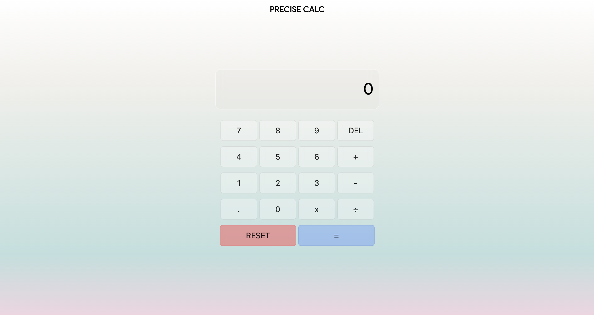

# PRECISE CALC - Calculator App

A modern, glass-morphism styled calculator application built as a Frontend Mentor challenge with a custom UI design.

## 🎨 Project Overview

This calculator application was created for the [Frontend Mentor Calculator App Challenge](https://www.frontendmentor.io/challenges/calculator-app-9lteq5N29), but features a completely custom design with a beautiful gradient background and frosted glass effect buttons.

### Design Preview



The interface features:
- **Minimalist Header**: "PRECISE CALC" title at the top
- **Glass-Morphism Display**: Semi-transparent display with backdrop blur effect showing calculations
- **Frosted Glass Buttons**: Interactive buttons with hover and active states
- **Gradient Background**: Smooth gradient transitioning from white through blues and pinks
- **Responsive Layout**: Organized button grid with dedicated RESET and equals (=) buttons

## ✨ Features

- ✅ **Basic Arithmetic Operations**: Addition, Subtraction, Multiplication, Division
- ✅ **Decimal Support**: Calculate with decimal numbers
- ✅ **Delete Function**: DEL button to remove the last entered digit
- ✅ **Reset Function**: Clear all calculations and reset to 0
- ✅ **Real-time Display**: Live calculation display with visual feedback
- ✅ **Smooth Animations**: Button hover and active state transitions
- ✅ **Modern UI**: Glass-morphism design with backdrop blur effects

## 🛠️ Technologies Used

- **HTML5**: Semantic markup structure
- **CSS3**: 
  - Gradient backgrounds
  - Backdrop filter effects (blur)
  - Flexbox layouts
  - CSS transitions and hover states
- **JavaScript (Vanilla)**: 
  - Event listeners for button interactions
  - Calculator logic for arithmetic operations
  - Dynamic display updates

## 📁 Project Structure

```
frontend_challenge3_calculator/
├── index.html      # HTML structure
├── styles.css      # CSS styling and layout
├── script.js       # JavaScript calculator logic
└── README.md       # This file
```

## 🎯 How to Use

1. **Clone or download the project**
2. **Open `index.html`** in your web browser
3. **Start calculating**:
   - Click number buttons to enter digits
   - Click operators (+, -, x, ÷) to perform calculations
   - Click "=" to see the result
   - Use "DEL" to remove the last digit
   - Use "RESET" to start over

## 🎨 Design Details

### Colors & Effects
- **Background Gradient**: White → Light Beige → Light Blue → Light Teal → Light Pink
- **Display**: Semi-transparent white with 10px backdrop blur
- **Buttons**: Semi-transparent white with 5px backdrop blur
- **Reset Button**: Semi-transparent red styling
- **Equals Button**: Semi-transparent blue styling

### Typography
- **Font**: Google Sans
- **Header Size**: 15px
- **Display Size**: 30px
- **Button Text**: 15px

### Interactions
- **Hover Effect**: Subtle shadow on buttons
- **Active State**: Increased transparency on click
- **Smooth Transitions**: 0.3s ease transitions for all state changes

## 📝 Code Highlights

### Calculator Logic
The calculator implements a two-variable system (`var1`, `var2`) to handle operations:
- When an operator is clicked, the first number is stored in `var1`
- The second number is entered as `var2`
- When "=" is pressed, the appropriate operation is performed
- The last calculation is displayed for reference

### Event Handling
All buttons are connected via event listeners that:
1. Update the display with input
2. Store operation information
3. Calculate results
4. Manage display state

## 🚀 Future Improvements

- Add keyboard support (number pad integration)
- Implement calculation history
- Add themes (light/dark mode)
- Improve error handling for edge cases
- Add memory functions (M+, M-, MR, MC)
- Mobile responsiveness optimization

## 📱 Browser Compatibility

- Chrome (latest)
- Firefox (latest)
- Safari (latest)
- Edge (latest)

## 📚 Learning Resources

This project demonstrates:
- DOM manipulation with vanilla JavaScript
- CSS layout techniques (Flexbox)
- Event handling and listeners
- State management with variables
- Modern CSS effects (backdrop-filter, gradients)

## 🎓 Challenge Source

[Frontend Mentor - Calculator App Challenge](https://www.frontendmentor.io/challenges/calculator-app-9lteq5N29)

---

**Created by**: Abbad  
**Challenge Difficulty**: Junior Level  
**Project Type**: Frontend Mentor Challenge
